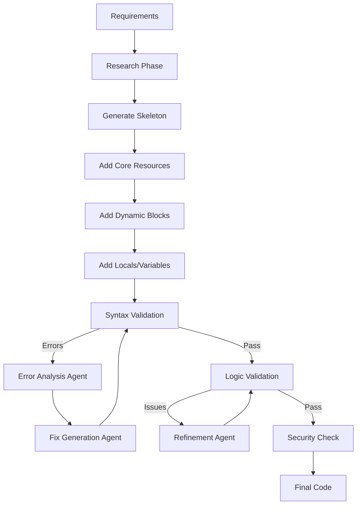

# Production-Ready IaC Code Generation: Best Practices

## The Problem: Why AI-Generated Code Has Quality Issues

### Root Causes:
1. **Model Limitations**: Even advanced models (GPT-4, Claude) struggle with:
   - Complex conditional logic (locals, dynamic blocks)
   - Language-specific syntax nuances (HCL, Bicep)
   - Module interdependencies and data flow
   - Edge cases and error handling

2. **Context Window**: Models lose context with large codebases
3. **Lack of Validation**: No built-in syntax checking during generation
4. **Generic Patterns**: Models use common patterns that may not fit specific scenarios

## How GitHub Copilot Handles This (Strategies You Can Adopt)

### 1. **Validation Layer Pattern**
Copilot doesn't just generate - it validates through multiple passes:

```python
# Pseudo-code for how Copilot approaches code generation
def generate_iac_code(requirements):
    # Pass 1: Generate initial code
    code = model.generate(requirements)
    
    # Pass 2: Syntax validation
    syntax_errors = validate_syntax(code)
    if syntax_errors:
        code = model.fix_errors(code, syntax_errors)
    
    # Pass 3: Logic validation
    logic_issues = validate_logic(code)
    if logic_issues:
        code = model.refine(code, logic_issues)
    
    # Pass 4: Best practices check
    issues = lint(code)
    if issues:
        code = model.improve(code, issues)
    
    return code
```

### 2. **Iterative Refinement with Tool Feedback**

#### Implementation for SynthForge.AI:

**Add Validation Agent** (after code generation):

```yaml
validation_agent:
  name: "IaCValidationAgent"
  description: "Validates generated IaC code and provides fix recommendations"
  
  instructions: |
    You validate generated Terraform/Bicep code for:
    1. Syntax correctness
    2. Logical consistency
    3. Best practices adherence
    4. Security issues
    
    ## Validation Steps
    
    ### Step 1: Run Syntax Validation
    - Terraform: `terraform validate`
    - Bicep: `bicep build`
    - Parse errors and identify locations
    
    ### Step 2: Analyze Logic Issues
    - Undefined variables/locals
    - Incorrect dynamic block usage
    - Missing required attributes
    - Type mismatches
    
    ### Step 3: Security & Best Practices
    - Hardcoded secrets
    - Missing lifecycle rules
    - Insecure defaults
    - AVM pattern deviations
    
    ### Step 4: Generate Fix Recommendations
    For each issue found:
    ```json
    {
      "file": "modules/api-management/locals.tf",
      "line": 5,
      "issue_type": "syntax_error",
      "severity": "error",
      "message": "Conditional expression must evaluate to boolean",
      "current_code": "var.managed_identities.system_assigned || ...",
      "suggested_fix": "var.managed_identities.system_assigned != null ? true : false || ...",
      "explanation": "In Terraform, || requires boolean operands. Use explicit comparison."
    }
    ```
    
  output_format:
    validation_results:
      - file: string
        issues: array
        overall_status: "pass" | "fail" | "warning"
```

### 3. **Template-Based Generation with Tested Patterns**

Instead of generating from scratch every time, use **validated templates**:

#### Create a Template Library:

```
iac/templates/
  terraform/
    resource_with_identity.tf.template
    resource_with_pe.tf.template
    locals_managed_identity.tf.template
  bicep/
    resource_with_identity.bicep.template
```

**Example Template** (tested and working):

```hcl
# templates/terraform/locals_managed_identity.tf.template
locals {
  managed_identities = {
    system_or_user_assigned = (
      var.managed_identities.system_assigned == true
      || length(var.managed_identities.user_assigned_resource_ids) > 0
    ) ? {
      this = {
        type = (
          var.managed_identities.system_assigned == true 
          && length(var.managed_identities.user_assigned_resource_ids) > 0
        ) ? "SystemAssigned, UserAssigned" : (
          length(var.managed_identities.user_assigned_resource_ids) > 0
          ? "UserAssigned"
          : "SystemAssigned"
        )
        user_assigned_resource_ids = var.managed_identities.user_assigned_resource_ids
      }
    } : {}
  }
}
```

**Agent uses templates**:
```yaml
module_generation_instructions: |
  1. Search template library for matching pattern
  2. If template exists:
     - Use template as base
     - Substitute variables
     - Validate result
  3. If no template:
     - Generate from scratch
     - Validate thoroughly
     - Save as new template if successful
```

### 4. **Multi-Stage Generation Pipeline**



### 5. **Specific Fixes for Common Issues**

#### Issue 1: Complex Conditional Logic in Locals

**Problem:**
```hcl
# Generated code - BROKEN
locals {
  managed_identities = {
    system_or_user_assigned = (
      var.managed_identities.system_assigned  # NOT boolean check!
      || length(var.managed_identities.user_assigned_resource_ids) > 0
    ) ? {
```

**Fix Pattern:**
```hcl
# Add explicit boolean comparison
locals {
  managed_identities = {
    system_or_user_assigned = (
      var.managed_identities.system_assigned == true
      || length(var.managed_identities.user_assigned_resource_ids) > 0
    ) ? {
```

**Agent Instruction:**
```yaml
locals_generation_rules:
  - "Always use explicit boolean comparisons (== true, != null)"
  - "Test conditional operators with parentheses grouping"
  - "Validate ternary expressions have correct precedence"
```

#### Issue 2: Incorrect Dynamic Block Iteration

**Problem:**
```hcl
# May not iterate correctly if value is complex
dynamic "identity" {
  for_each = local.managed_identities.system_or_user_assigned
  content {
    type = identity.value.type  # May fail if structure wrong
```

**Fix Pattern:**
```hcl
# Ensure for_each produces map or set
dynamic "identity" {
  for_each = length(keys(local.managed_identities.system_or_user_assigned)) > 0 ? local.managed_identities.system_or_user_assigned : {}
  content {
    type         = identity.value.type
    identity_ids = lookup(identity.value, "user_assigned_resource_ids", null)
```

#### Issue 3: Module Reference Errors

**Problem:**
```hcl
module "diagnostics" {
  source = "../diagnostics"  # Path may not exist
  count  = length(var.diagnostic_settings) > 0 ? 1 : 0
  
  # Accessing nested without null check
  workspace_id = var.diagnostic_settings.default.workspace_resource_id
```

**Fix Pattern:**
```hcl
module "diagnostics" {
  source = "../diagnostics"
  count  = var.diagnostic_settings != null ? 1 : 0
  
  # Safe access with try()
  workspace_id = try(var.diagnostic_settings.workspace_resource_id, null)
```

### 6. **Validation Tools Integration**

Add automated tools to the pipeline:

```python
# validation_pipeline.py
class IaCValidationPipeline:
    def __init__(self, code_path, iac_type):
        self.code_path = code_path
        self.iac_type = iac_type
        
    def validate(self):
        results = []
        
        # 1. Syntax validation
        if self.iac_type == "terraform":
            results.append(self.run_terraform_validate())
            results.append(self.run_tflint())
            results.append(self.run_checkov())
        elif self.iac_type == "bicep":
            results.append(self.run_bicep_build())
            results.append(self.run_bicep_lint())
            
        # 2. Custom logic checks
        results.append(self.check_variable_usage())
        results.append(self.check_module_references())
        results.append(self.check_locals_logic())
        
        return self.aggregate_results(results)
    
    def run_terraform_validate(self):
        result = subprocess.run(
            ["terraform", "validate", "-json"],
            cwd=self.code_path,
            capture_output=True
        )
        return json.loads(result.stdout)
```

**Add to agent workflow:**

```yaml
post_generation_steps:
  1. Generate code with Module Development Agent
  2. Save to temporary directory
  3. Run validation pipeline:
     - terraform init
     - terraform validate
     - tflint
     - Custom checks
  4. If errors:
     - Send errors to Validation Agent
     - Get fix recommendations
     - Apply fixes to code
     - Repeat validation
  5. If pass:
     - Save final code
     - Document patterns used
```

### 7. **Constrained Generation with Schemas**

Use JSON schemas to constrain outputs:

```json
{
  "terraform_locals_schema": {
    "type": "object",
    "properties": {
      "managed_identities": {
        "type": "object",
        "properties": {
          "system_or_user_assigned": {
            "type": "object",
            "description": "Map with single 'this' key when identity enabled"
          }
        }
      }
    },
    "validation_rules": [
      "All boolean comparisons must use == or !=",
      "All map access must handle empty case",
      "All ternary expressions must have explicit parentheses"
    ]
  }
}
```

### 8. **Test-Driven Generation**

Generate tests alongside code:

```yaml
module_development_agent_enhancement:
  instructions: |
    For EACH module generated:
    
    1. Generate the module code
    2. Generate test cases:
       ```hcl
       # tests/api-management.tftest.hcl
       run "test_with_system_identity" {
         command = plan
         
         variables {
           managed_identities = {
             system_assigned = true
             user_assigned_resource_ids = []
           }
         }
         
         assert {
           condition = length(azurerm_api_management.this.identity) == 1
           error_message = "Identity block should exist"
         }
         
         assert {
           condition = azurerm_api_management.this.identity[0].type == "SystemAssigned"
           error_message = "Identity type should be SystemAssigned"
         }
       }
       ```
    
    3. Run tests:
       - terraform test
       - Verify all assertions pass
    
    4. If tests fail:
       - Analyze failure
       - Fix code
       - Re-run tests
```

## Recommended Architecture Changes

### Add New Agent: Code Quality Agent

```yaml
# iac_agent_instructions.yaml

code_quality_agent:
  name: "CodeQualityAgent"
  description: "Reviews and improves generated IaC code quality"
  
  responsibilities:
    - "Validate syntax correctness"
    - "Check logical consistency"
    - "Verify best practices"
    - "Generate fix recommendations"
    - "Create test cases"
  
  workflow:
    input: "Generated IaC code from Module Development Agent"
    output: "Validated code + quality report + tests"
    
  tools_available:
    - terraform_validate
    - tflint
    - checkov
    - bicep_build
    - custom_validators
  
  instructions: |
    You are a code quality specialist for Infrastructure as Code.
    
    ## Your Process:
    
    ### 1. Initial Validation
    Run appropriate validators:
    - Terraform: `terraform init && terraform validate`
    - Bicep: `bicep build --file <file>`
    
    ### 2. Parse Errors
    For each error:
    - Identify file and line number
    - Classify error type (syntax, logic, reference)
    - Determine root cause
    
    ### 3. Generate Fixes
    For each issue:
    ```json
    {
      "issue": {
        "file": "string",
        "line": number,
        "type": "syntax|logic|reference|security",
        "severity": "error|warning",
        "message": "string",
        "current_code": "string"
      },
      "fix": {
        "suggested_code": "string",
        "explanation": "string",
        "confidence": "high|medium|low",
        "alternative_approaches": ["string"]
      }
    }
    ```
    
    ### 4. Best Practices Review
    Check for:
    - Explicit boolean comparisons in conditionals
    - Null-safe access patterns (try(), lookup())
    - Proper dynamic block structure
    - Lifecycle rules where appropriate
    - Security: no hardcoded secrets, private endpoints used
    
    ### 5. Generate Tests
    Create Terraform test cases (or Bicep tests):
    - Test with minimal config
    - Test with full config
    - Test edge cases (empty lists, nulls)
    
    ## Common Issues & Fixes
    
    See detailed patterns in code_quality_patterns.md
```

### Update Module Development Agent

```yaml
# Add to module_development_agent in iac_agent_instructions.yaml

  post_generation_validation:
    enabled: true
    workflow: |
      After generating module code:
      
      1. Self-review for common issues:
         - Check all conditionals use explicit boolean comparisons
         - Verify all map/list access handles empty cases
         - Ensure dynamic blocks have correct for_each structure
      
      2. Send code to Code Quality Agent for validation
      
      3. Receive validation results:
         - If errors: Apply fixes and regenerate
         - If warnings: Document for user review
         - If pass: Proceed to next module
      
      4. Generate module tests
      
      5. Verify tests pass
```

## Implementation Roadmap

### Phase 1: Add Validation (Week 1)
1. Create validation_agent in instructions
2. Add terraform validate / bicep build to pipeline
3. Implement error feedback loop

### Phase 2: Template Library (Week 2)
1. Extract working patterns from existing code
2. Create validated templates
3. Update agents to use templates

### Phase 3: Test Generation (Week 3)
1. Add test generation to module agent
2. Integrate terraform test / bicep test
3. Fail generation if tests don't pass

### Phase 4: Quality Metrics (Week 4)
1. Add quality scoring
2. Track error rates
3. Improve based on metrics

## Immediate Quick Wins

### Fix 1: Add Explicit Boolean Comparisons

Update instructions:

```yaml
module_development_agent:
  code_generation_rules:
    terraform_specific:
      - rule: "ALWAYS use explicit boolean comparisons"
        examples:
          - wrong: "var.enable_feature"
          - correct: "var.enable_feature == true"
      
      - rule: "ALWAYS use explicit null checks"
        examples:
          - wrong: "var.config"
          - correct: "var.config != null"
      
      - rule: "Use try() for nested access"
        examples:
          - wrong: "var.settings.network.subnet_id"
          - correct: "try(var.settings.network.subnet_id, null)"
```

### Fix 2: Add Validation Step

```python
# main.py - Add after module generation

def generate_modules_with_validation(modules_spec):
    for module in modules_spec:
        # Generate module
        code = module_agent.generate(module)
        
        # Validate
        validation_result = validate_terraform(code)
        
        # If errors, try to fix
        retry_count = 0
        while validation_result.has_errors and retry_count < 3:
            fix_instructions = create_fix_prompt(validation_result)
            code = module_agent.fix(code, fix_instructions)
            validation_result = validate_terraform(code)
            retry_count += 1
        
        # Save or report errors
        if validation_result.has_errors:
            log_error(f"Module {module.name} has unfixable errors")
        else:
            save_module(code)
```

## Summary

**The model IS smart enough**, but needs:
1. ✅ **Validation feedback loops** (like Copilot uses)
2. ✅ **Tested templates** for complex patterns
3. ✅ **Iterative refinement** with error correction
4. ✅ **Explicit rules** for syntax nuances
5. ✅ **Test-driven generation** to catch issues early

**Next Steps:**
1. Add Code Quality Agent to instructions
2. Implement validation pipeline
3. Create template library from working code
4. Add test generation to module agent

This mirrors how GitHub Copilot works - not by being perfect on first try, but by validating and refining until code quality meets standards.
